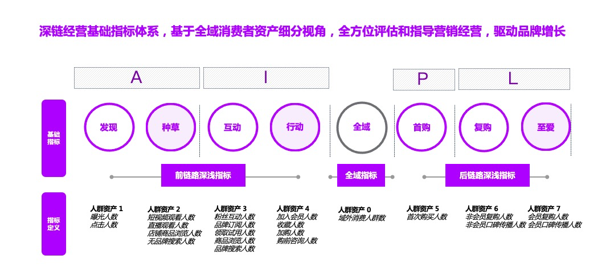

# 达摩盘
达摩盘是阿里妈妈下，帮助卖家建立个性化的用户细分和精准营销的工具，现在通过全域和深度链路助力品牌进行营销。
达摩盘作为阿里妈妈精细化消费者运营定向中台，为商家提供海量标签，支持商家自由组合，快速有效圈定目标人群，
同时为商家提供精细化人群画像洞察功能，联动多渠道进行投放，并提供人群投放的后链路追踪，助力商家进行全链路消费者运营。

对于商家，达摩盘"盘人准"，能解决人群拓展难题。

1. **案例1：** [智能家电制造商追觅](https://www.163.com/dy/article/H71Q858J05118513.html "日销增长10倍，达摩盘成黑马品牌上新打爆武器")

# 品牌版

达摩盘品牌版的营销策略中心主要分为DEEPLINK、营销洞察、全域结案和应用锦囊三个

## DEEPLINK

### DEEPLINK

深链营销（ DEEPLINK）是依托于阿里提出的AIPL在营销应用端的细化消费者资产指标，以精细化消费者**旅程**为中心，
结合“基础指标+运营指标+场景应用”，体系化衡量、助力品牌增长。

> 全球疫情的反复动荡中，面对巨变的不确定性，营销环境的巨变愈发深入——消费者链路持续演变，呈现触点多样化、
链路个性化和行为变化快的显著特征；消费者的浅层次、高频触达增加，但与其长期连结和加深的难度大大提升；
品牌亟待一套面向“深度链接”的营销解决方案，它能够帮助还原消费者**旅程**的真实全貌，并在过程中提供穿越不同的场景持续触达、
持续加深、持续转化的解决方案。

#### DEEPLINK模型

**【深链经营（DEEPLINK）指标体系与AIPL[^1]关系】**

[^1]: https://zhuanlan.zhihu.com/p/263008775

深链经营（ DEEPLINK）基于品牌数据银行“AIPL消费者运营”，在营销应用端的细化消费者资产指标，将AIPL四大维度进行进一步拆解、
并与品牌全域AIPL资产呈完全映射关系，从而能够快速助力品牌的分析、应用深化。

#### 功能价值

1、**品牌DEEPLINK资产分布，以精细化消费者旅程为中心**，帮助品牌更清晰、更全面了解消费者资产分层和结构，满足多场景下运营评估衡量诉求；

2、**首推品牌DEELINK资产流转*细化营销媒介触点分析**，帮助品牌挖掘消费者旅程优化背后最佳营销渠道组合，助力品牌优化营销渠道策略；

### 全域资产洞察

为帮助打通商家淘内外数据，结合多维度场景和行业特性来挖掘数据的商业化价值，提供人群策略+货品推荐+营销渠道+经营结案的全链路经营服务，
帮助商家进行全域资产的量化和再应用，实现真正意义上的全域视角经营

#### 功能价值

1、**全域Universal资产之“全”**：Universal资产包含品牌一方数据
（阿里云QuickAudience一方CDP数据沉淀、一方会员数据、一方数据上传）、
以及阿里域内站外投放回流资产、阿里域站内媒介触点沉淀资产，
为品牌提供整体视角来监控整体资产变化；

2、**全域Universal资产之“用”**：帮助品牌基于全域资产，结合阿里域内DEEPLINK
资产状态进行差异化高效人群资产运营，并同步支持自定义灵活组合进行全域资产洞察，
如：品牌一方资产&品牌外投其他媒体触达资产的全域洞察，
提供在阿里域内的再营销策略，提升品牌资产运营流转率和加深率。

#### 全域运营策略

1. 【全域DEEP】潜客人群再收割：
针对外投/一方人群资产交集品牌DEEPLINK的人群资产，
围绕全域DEEP人群直投/交集更多特征，应用广告营销投放，加速潜客人群转化；
2. 【全域NK】复购人群looklike放大，挖掘拉新机会人群：
基于外投/一方人群资产交集品牌NK人群资产，结合达摩盘智能扩展能力，
looklike更多优质拉新机会人群，应用广告营销投放，提升品牌拉新效率
3. 【全域I】首购人群加速复购，提升转化效率：
基于外投/一方人群资产交集品牌I人群资产，在达摩盘上直投/交集更多特征，
应用广告营销投放，提升首购消费者复购概率，加速转化。

## 营销洞察

### 人群营销价值诊断

#### 功能价值

1. **人群价值评估**：系统基于人群成长空间、人群商业价值、本店转化机会和近30天营销投放效率，
提供营销投放价值评级；
2. **人群优化建议和渠道建议**：系统提供人群规模智能调整、本店未成交人群圈选和渠道预估展现，
助力店铺更好投放；

功能分为：人群营销投放价值评级、人群成长空间、人群商业价值、本店转化机会和近30天营销投放效率。

### 人群画像洞察

基于用户特征、品类特征、渠道特征、私域特征为您提供人群画像特征洞察，同时引入CTR、PPC等指标助力人群投前全方位分析！基于人群洞察核心显著性特征，从引流效率、转化效率维度系统智能提供标签组合，提升商家人群创建效率！

#### 功能核心价值：

1. **洞察维度升级**：基于用户特征、品类特征、渠道特征、私域特征为您提供人群画像特征洞察，助力全方位立体刻画目标消费者；
2. **洞察指标丰富**：选择分渠道、分类目维度下相关特征CTR、PPC指标，清楚了解人群分特征不同历史投放效果，助力投前参考；
3. **洞察标签组合智能推荐**：系统基于洞察特征维度，提供引流效率、转化效率维度系统智能提供标签组合，提升商家人群创建效率！

功能分为：分析人群，对比分析，洞察分析和保存洞察设置->洞察标签组合智能推荐系统->查看不同维度下详细洞察特征

#### 品牌全域资产洞察

基于上传的全域人群资产，提供多维度立体洞察的功能，包含对全域资产的远近关系分析、
品牌竞争分析、行业活跃分析、淘内活跃分析、画像分析以及营销渠道分析这6大能力，并精准输出营销策略建议，助力店铺一网打尽全域资产，在各维度对比中明晰得失，借此挖掘潜在的营销机会。

#### 功能价值

1. 俯瞰全域资产
2. 明晰资产得失
3. 挖掘营销机会

功能分为：自定义全域资产人群、全域资产远近分析（店铺、品牌、竞品、行业、淘内）、
全域资产品牌竞争分析、全域资产行业活跃分析、全域资产淘内活跃分析、
全域资产营销渠道分析、全域资产画像分析

### 货品运营-新品洞察

货品运营中心基于达摩盘全新推出的货品运营方法论，围绕货品生命周期（新品-潜品-爆品-尾品）诊断、人货关联匹配、货品七力诊断的能力，帮助商家全面、体系的实现生意长线增长。
本期达摩盘货品运营中心以新品**冷启动场景**为切入点，通过拆解GMV影响因子、对照优秀标杆新品四力成长路线，发挥货品长板优势，弥补短板劣势，帮助商家进一步优化新品冷启动成长策略。

#### 功能价值

1. 货品分层扫描
2. GMV全面透析
3. 单品冷启动降难度

功能分为：店铺货品结构、货品top榜单、新品诊断策略（单品数据概况、趋势力&GMV诊断、营销力诊断、产品力诊断、创意力诊断）

### 单品策略人群分析

系统为您提供店铺流量/成交TOP单品人群策略分析，基于单品人群远近关系，从单品-店铺-品牌-行业维度提供全域单品人群策略，助力商家锁定核心单品目标TA！

### 单品场景智能洞察圈人

### 直播洞察圈人

### 营销渠道洞察

### 店铺超级用户&超级新用户

### 会员场景洞察分析

### DEEPLINK细分市场资产空间

## 全域结案

### 品牌经营力月报介绍

### 品牌广告结案一键推送

## <u>应用锦囊</u>

### <u>全域资产洞察-分析方向解读</u>

## 思考

1. 大数据对营销形式的指导：比如抖音，短视频的风格“风味”
（按人群画像来制定，精准营销 潮/典雅/清新/科技感/氛围感 年龄段 性别 职业）
-- 对于拓展和吸引人群，应该很用效果，需求是可以激发出来的

## 问题

1. 营销有很多是在基于人群的分析，我看人群包可以直接创建，也可以自己上传，人群包一般包含哪些数据呢？
2. 阿里云Quick Audience人群同步那节中描述了推送受众的量级，提到了ONE ID Mapping，能简单介绍下吗？
3. DEEPLINK资产分布及流转小节中，描述品牌DEEPLINK资产流转分布，只看一段时间内人群所达到的最高状态，不看流出和流失的。
我看DEEP这几个层次统计的主要是15天内的数据，如果要做长时间段的分析比如两、三个月时间段，还能反映出流转的真实情况吗？
如果要做长时间段的分析，可不可以把这段时间内的，资产流转的过程绘制出来，而不是只给一个最高状态？
4. 会员溢价部分，统计周期内成交会员客单价/成交非会员客单价，这个比值大于1的话，会员能接受吗？

